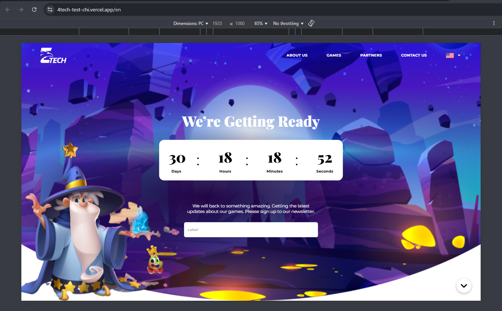
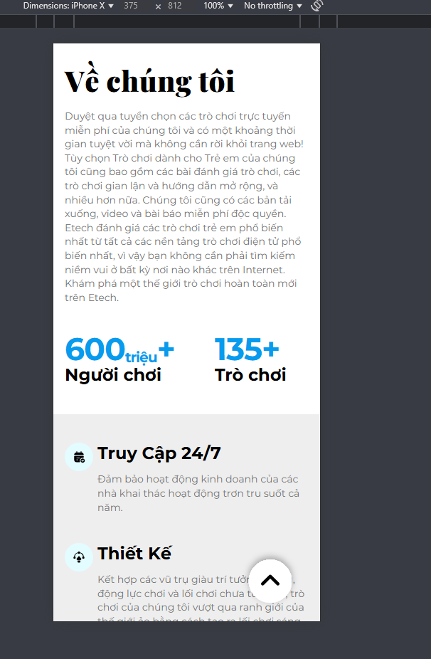
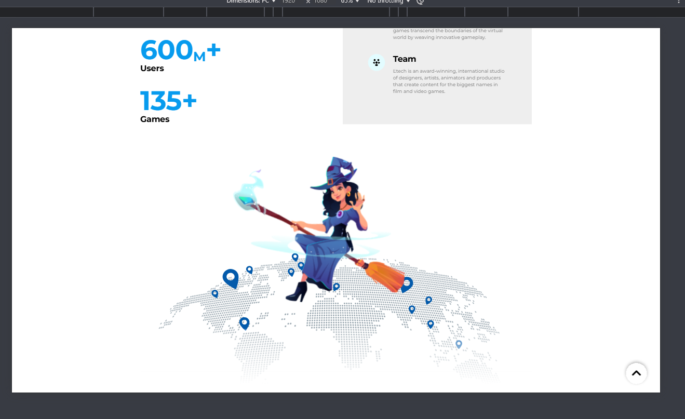
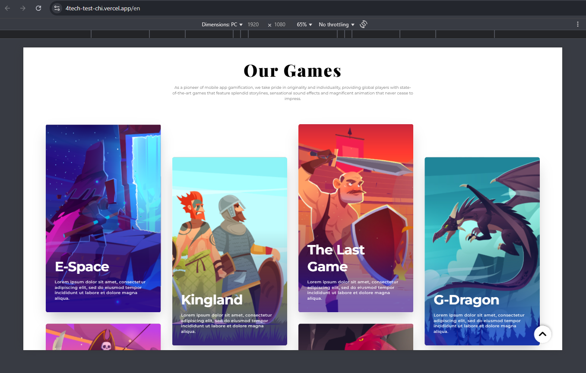
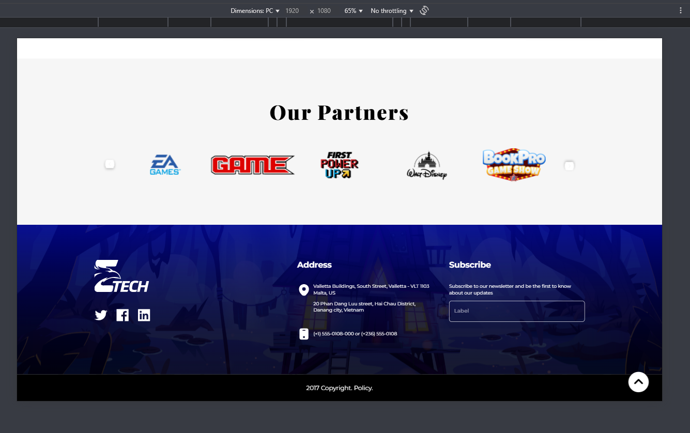
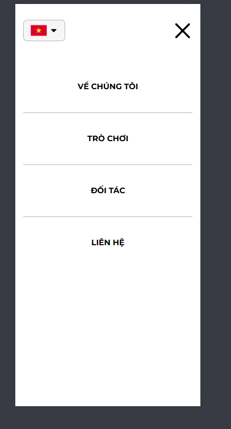

# 4TECH LANDING PAGE

Demo

<div style="display:block">
  
</div>

# Demo

- And go to link below to see project:
  [https://4tech-test-chi.vercel.app](https://4tech-test-chi.vercel.app/vi)

## Instructions

- Clone the repo:
  ```bash
  git clone git@github.com:duydpdev/4tech-test.git
  ```
- Move to the folder:
  ```bash
  cd 4tech-test
  ```
- Install package
  ```bash
  yarn
  ```
- Run project (env: dev)

  ```bash
  yarn dev
  ```

- And go to link below to see project:
  [http://localhost:3000/](http://localhost:3000/)

## Screenshots

| PC                                              | Mobile                                                 |
| ----------------------------------------------- | ------------------------------------------------------ |
|  |  |
|   |   |
|                |                |
|                |                |
|      |       |
|                |                         |
